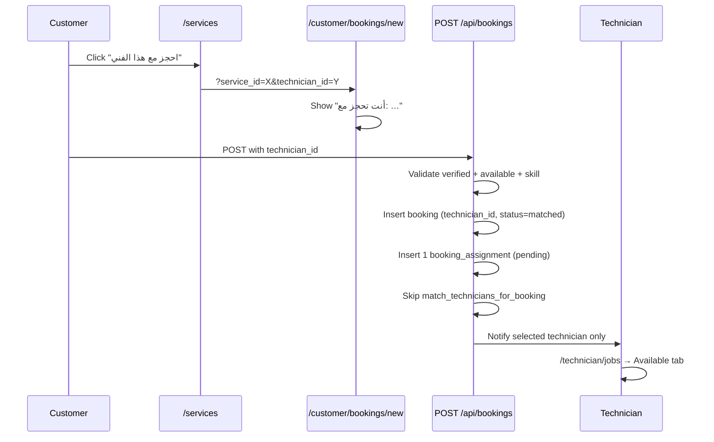

# Direct Booking — True Technician Selection
# الحجز المباشر — اختيار صنايعي محدد

**Last updated:** 2025-06-26

When a customer picks a technician from `/services` (browse cards or map), the booking is assigned **only** to that technician — no `match_technicians_for_booking` RPC, no multi-tech fan-out.

---

## Modified files

| File | Change |
|------|--------|
| `src/lib/booking/booking-links.ts` | Builds `/customer/bookings/new?service_id=&technician_id=` |
| `src/components/services/technician-browse-card.tsx` | **احجز مع هذا الفني** button → direct booking URL |
| `src/lib/technicians/map-markers.ts` | Map popup `bookingHref` with service + technician |
| `src/components/maps/technicians-map-inner.tsx` | **احجز الآن** link in popup |
| `src/app/customer/bookings/new/page.tsx` | Reads query params, RTL UI, selected technician banner |
| `src/components/booking/selected-technician-banner.tsx` | Shows name, avatar, specialty, rating; link back to `/services` |
| `src/components/shared/booking-form.tsx` | Hidden `technician_id`, locks service when pre-selected |
| `src/hooks/use-browse-technicians.ts` | `useTechnicianPreview()` for booking page |
| `src/app/api/technicians/[id]/route.ts` | `GET` single verified technician preview |
| `src/app/api/bookings/route.ts` | Direct vs auto-match branching |
| `src/lib/validations/booking.ts` | Optional `technician_id` in Zod schema |

---

## Database changes

**None — uses existing columns:**

- `bookings.technician_id` (UUID, nullable)
- `bookings.status` → `'matched'` on direct book
- `booking_assignments` — one row, `status = 'pending'`

No new migration required.

---

## Flow



---

## API examples

### Direct booking

**Request**

```http
POST /api/bookings
Authorization: Bearer <customer_access_token>
Content-Type: application/json
```

```json
{
  "service_id": "a1b2c3d4-e5f6-7890-abcd-ef1234567890",
  "technician_id": "f9e8d7c6-b5a4-3210-fedc-ba0987654321",
  "description": "تسريب مياه في الحمام يحتاج إصلاح عاجل",
  "location_address": "القاهرة، مصر",
  "location_lat": 30.0444,
  "location_lng": 31.2357,
  "preferred_time": "2025-07-01T10:00:00",
  "image_urls": []
}
```

**Response `201`**

```json
{
  "id": "booking-uuid",
  "customer_id": "customer-uuid",
  "service_id": "a1b2c3d4-e5f6-7890-abcd-ef1234567890",
  "technician_id": "f9e8d7c6-b5a4-3210-fedc-ba0987654321",
  "status": "matched",
  "description": "تسريب مياه في الحمام يحتاج إصلاح عاجل",
  "location_address": "القاهرة، مصر",
  "location_lat": 30.0444,
  "location_lng": 31.2357,
  "preferred_time": "2025-07-01T07:00:00.000Z",
  "price_quote": null,
  "created_at": "2025-06-26T12:00:00.000Z",
  "updated_at": "2025-06-26T12:00:00.000Z",
  "services": {
    "name_ar": "سباكة",
    "name_en": "Plumbing",
    "slug": "plumbing"
  }
}
```

**Validation errors**

| Condition | Status | Message |
|-----------|--------|---------|
| Technician not found | 404 | `Technician not found` |
| Not verified | 422 | `Selected technician is not verified yet` |
| Not available | 422 | `Selected technician is not available` |
| No active skill for service | 422 | `Selected technician does not offer this service` |

### Auto-match (no technician_id)

**Request** — omit `technician_id`:

```json
{
  "service_id": "a1b2c3d4-e5f6-7890-abcd-ef1234567890",
  "description": "General booking without pre-selected technician",
  "location_address": "Cairo, Egypt",
  "location_lat": 30.0444,
  "location_lng": 31.2357,
  "image_urls": []
}
```

**Behavior**

- `bookings.status` starts `pending`, RPC `match_technicians_for_booking` runs
- Up to **3** `booking_assignments` rows (`status = pending`)
- `bookings.technician_id` remains `null` until a technician accepts
- All matched technicians receive notifications

---

## E2E verification

### 1. Entry from `/services`

1. Log in as customer → open `/services`
2. Click **احجز مع هذا الفني** on Technician A's card
3. **Expected URL:** `/customer/bookings/new?service_id=<svc>&technician_id=<techA>`
4. **Expected UI:** Banner "أنت تحجز مع: [Technician A name]" with avatar, specialty, rating
5. Service field is read-only; no technician picker

### 2. Submit direct booking

1. Fill description (≥10 chars), address, submit
2. **Expected redirect:** `/customer/bookings/[id]`
3. **DB checks:**

```sql
-- Exactly one assignment for Technician A
SELECT technician_id, status
FROM booking_assignments
WHERE booking_id = '<booking_id>';
-- Expected: 1 row, technician_id = techA, status = pending

-- Booking has technician_id set
SELECT technician_id, status FROM bookings WHERE id = '<booking_id>';
-- Expected: technician_id = techA, status = matched
```

### 3. Technician A sees job; B and C do not

1. Log in as **Technician A** → `/technician/jobs` → **Available** tab
2. **Expected:** New booking appears
3. Log in as **Technician B** and **Technician C** → **Available** tab
4. **Expected:** No assignment for this booking

```sql
-- Confirm only Tech A has a row
SELECT ba.technician_id, p.full_name
FROM booking_assignments ba
JOIN profiles p ON p.id = ba.technician_id
WHERE ba.booking_id = '<booking_id>';
-- Expected: single row for Technician A only
```

### 4. Auto-match control (no technician_id)

1. Create booking from `/customer/bookings/new` without query params
2. Do not pass `technician_id` in POST body
3. **Expected:** Up to 3 assignment rows; RPC invoked; `bookings.technician_id` null until accept

### 5. Map entry point

1. `/services/map` → click marker popup **احجز الآن**
2. Same URL pattern with `service_id` + `technician_id`

---

## Related docs

- [TEST-WORKFLOW.md](./TEST-WORKFLOW.md) — full QA playbook (Flow B: book from technician card)
- [PHASE-5.md](./PHASE-5.md) — matching & assignment engine
