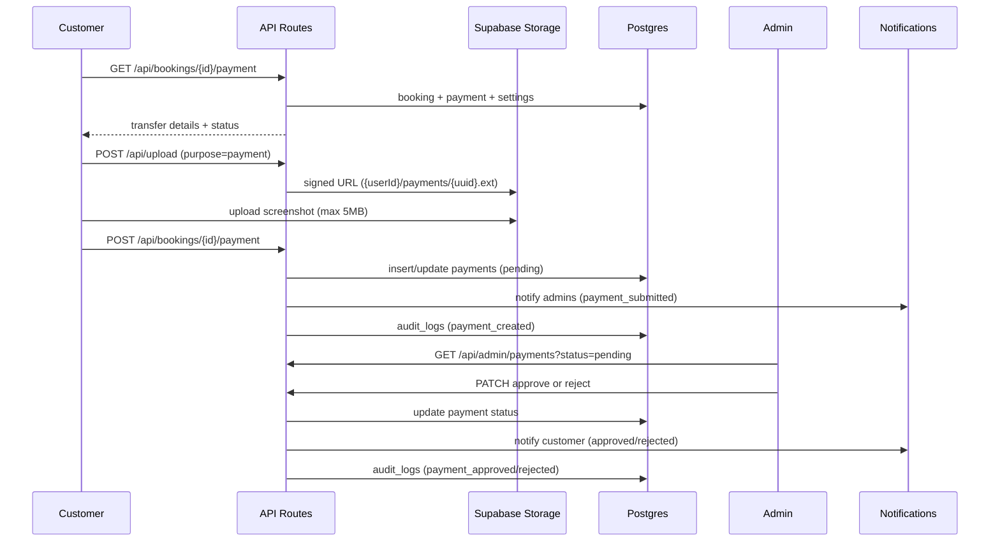

# Phase 11 — Manual Payments (InstaPay + Vodafone Cash)

Manual payment verification for Sanad. No payment gateways — customers transfer via InstaPay or Vodafone Cash, upload a screenshot, and admins approve or reject.

## Flow Diagram



## Database Schema

### `payments`

| Column | Type | Notes |
|--------|------|-------|
| `id` | UUID | PK |
| `booking_id` | UUID | UNIQUE, FK → bookings |
| `customer_id` | UUID | FK → profiles |
| `amount` | DECIMAL(10,2) | From booking `price_quote` |
| `payment_method` | enum | `instapay`, `vodafone_cash` |
| `screenshot_url` | TEXT | Public URL in `uploads` bucket |
| `status` | enum | `pending`, `approved`, `rejected` |
| `rejection_reason` | TEXT | Set on reject |
| `verified_by` | UUID | Admin profile |
| `verified_at` | TIMESTAMPTZ | Approval/rejection time |
| `created_at` | TIMESTAMPTZ | Submission time |

**Indexes:** `booking_id`, `customer_id`, `status`

**RLS:**
- Customers: SELECT/INSERT own; UPDATE own when `pending` or `rejected` (resubmit)
- Admins: full access via `is_admin()`

### `payment_settings` (singleton)

| Column | Type |
|--------|------|
| `id` | UUID (fixed singleton id) |
| `instapay_number` | TEXT |
| `instapay_name` | TEXT |
| `vodafone_cash_number` | TEXT |
| `instructions` | TEXT |
| `updated_at` | TIMESTAMPTZ |

**RLS:** authenticated read; admin write via `is_admin()`

Migration: `supabase/migrations/00019_payments.sql`

## Storage

- Bucket: `uploads`
- Path: `{userId}/payments/{uuid}.{ext}`
- Max size: **5MB** (payment uploads only; general uploads remain 10MB)
- Types: `image/jpeg`, `image/png`, `image/webp`, `application/pdf`

Upload API accepts `purpose: "payment"` to generate the payments subfolder path.

## API Routes

| Method | Route | Auth | Description |
|--------|-------|------|-------------|
| GET | `/api/bookings/[id]/payment` | Customer (owner) | Payment + settings + booking summary |
| POST | `/api/bookings/[id]/payment` | Customer (owner) | Submit or resubmit payment |
| GET | `/api/admin/payments` | Admin | List with `status` filter + pagination |
| PATCH | `/api/admin/payments/[id]/approve` | Admin | Approve pending payment |
| PATCH | `/api/admin/payments/[id]/reject` | Admin | Reject with `rejection_reason` |
| GET | `/api/admin/payment-settings` | Admin | Read singleton settings |
| PATCH | `/api/admin/payment-settings` | Admin | Update InstaPay/Vodafone details |

Validation: `src/lib/validations/payments.ts`

## UI Routes

| Route | Role | Purpose |
|-------|------|---------|
| `/customer/bookings/[id]/payment` | Customer | Pay / view status / resubmit |
| `/admin/payments` | Admin | Review queue with filters |
| `/admin/settings` | Admin | Payment account numbers + instructions |

Customer booking detail (`/customer/bookings/[id]`) shows payment status and link when `price_quote > 0`.

## Notifications

Events in `src/lib/notifications/events.ts`:

| Event | Recipient | Type |
|-------|-----------|------|
| Payment submitted | All admins | `payment_submitted` |
| Payment approved | Customer | `payment_approved` |
| Payment rejected | Customer | `payment_rejected` |

Entity type: `payment`

## Audit Logs

| Action | Trigger |
|--------|---------|
| `payment_created` | Customer submits payment |
| `payment_approved` | Admin approves |
| `payment_rejected` | Admin rejects |
| `payment_settings_updated` | Admin updates settings |

## Workflows

### Customer submit

1. Open booking → **Pay Now** (if quoted price exists)
2. Choose InstaPay or Vodafone Cash
3. Copy account number, complete transfer externally
4. Upload screenshot (≤5MB)
5. Submit → status **Pending**

### Admin review

1. Open **Admin → Payments** (default filter: Pending)
2. View screenshot in new tab
3. **Approve** → customer notified
4. **Reject** with reason → customer can resubmit

### Resubmit after rejection

Customer returns to payment page, uploads new screenshot, submits again. Same `payments` row is updated back to `pending`.

## Apply Migration

```bash
supabase db push
# or
supabase db reset
```

## Files Added

- `supabase/migrations/00019_payments.sql`
- `src/types/payments.ts`
- `src/lib/validations/payments.ts`
- `src/app/api/bookings/[id]/payment/route.ts`
- `src/app/api/admin/payments/route.ts`
- `src/app/api/admin/payments/[id]/approve/route.ts`
- `src/app/api/admin/payments/[id]/reject/route.ts`
- `src/app/api/admin/payment-settings/route.ts`
- `src/hooks/use-payments.ts`
- `src/components/payments/payment-status-badge.tsx`
- `src/components/payments/customer-payment-page-client.tsx`
- `src/app/customer/bookings/[id]/payment/page.tsx`
- `src/app/admin/payments/page.tsx`
- `docs/PHASE-11-PAYMENTS.md`
